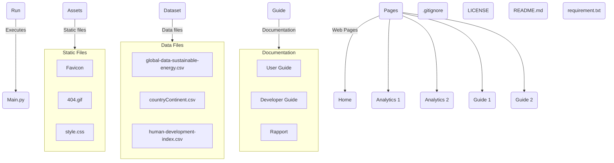
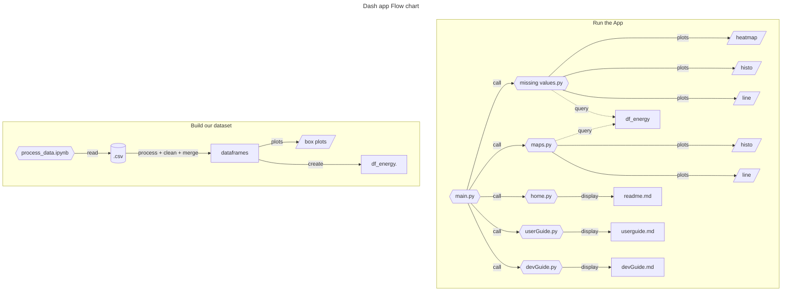

# <center>Developer Guide :</center> 

The purpose is to allows you to understand the architecture of the code and modify or extend it.

--- 

## Project structure : 
### Mermaid magic: 



### Multi-pages :
This multi-pages repository is set like the [official documentation](https://dash.plotly.com/urls) guidelines.

Here were going through each folder and give a little detail of what is it.
- The `.run` folder is a default folder for the running configuration (made by PyCharm itself)
- The asset system is detailed [here](https://dash.plotly.com/external-resources).
- The dataset folder contain each dataset csv and the ipython notebook associated to the data cleaning and aggregation.
- The guide folder contain some markdown files
- The **Pages** folder contain a .py file per pages on the Dash app. 
- The **main.py** is the entry point of the project. It is the luncher of the dash app.
- The `.gitignore` is the file which indicate the file and folder to do not commit and push on the git repo (set by GitHub and modify by us)
- The `LICENSE` is the file which indicate under which condition the project could be used. (set by GitHub) 
- The `README.md` fie is the landing page on GitHub. contain a brief description of the project.
- The `requirement.txt` is the list of all necessary dependency with the version.





## How to Guide : 

### Add an element to the Dash app layout : 
```python
layout = html.Div(
    className="new-element-class",
    children=[
        html.H1('This a heading 1'),
    ]
```

### customise the Dash app : 
['aggrnyl', 'agsunset', 'algae', 'amp', 'armyrose', 'balance',
 'blackbody', 'bluered', 'blues', 'blugrn', 'bluyl', 'brbg',
 'brwnyl', 'bugn', 'bupu', 'burg', 'burgyl', 'cividis', 'curl',
 'darkmint', 'deep', 'delta', 'dense', 'earth', 'edge', 'electric',
 'emrld', 'fall', 'geyser', 'gnbu', 'gray', 'greens', 'greys',
 'haline', 'hot', 'hsv', 'ice', 'icefire', 'inferno', 'jet',
 'magenta', 'magma', 'matter', 'mint', 'mrybm', 'mygbm', 'oranges',
 'orrd', 'oryel', 'oxy', 'peach', 'phase', 'picnic', 'pinkyl',
 'piyg', 'plasma', 'plotly3', 'portland', 'prgn', 'pubu', 'pubugn',
 'puor', 'purd', 'purp', 'purples', 'purpor', 'rainbow', 'rdbu',
 'rdgy', 'rdpu', 'rdylbu', 'rdylgn', 'redor', 'reds', 'solar',
 'spectral', 'speed', 'sunset', 'sunsetdark', 'teal', 'tealgrn',
 'tealrose', 'tempo', 'temps', 'thermal', 'tropic', 'turbid',
 'turbo', 'twilight', 'viridis', 'ylgn', 'ylgnbu', 'ylorbr',
 'ylorrd'].

### Theming plotly : 
"plotly", "plotly_white", "plotly_dark", "ggplot2", "seaborn", "simple_white"
